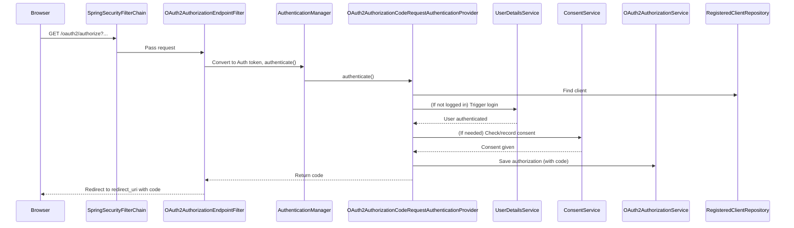

Let’s walk through **exactly what happens, step by step, when you hit**  
`http://localhost:8081/oauth2/authorize?response_type=code&client_id=client&redirect_uri=http://localhost:9000/authorized&scope=read`  
in your Spring Authorization Server.

---

## **Step-by-Step Flow: What Happens When You Call `/oauth2/authorize`?**

### **1. HTTP Request Arrives**

- The browser (or HTTP client) sends a **GET** request to `/oauth2/authorize` with the provided query parameters.

---

### **2. Spring Security Filter Chain**

- The request enters the **Spring Security filter chain**.
- The filter chain is configured by your `SecurityConfig` and includes:
  - Security context persistence
  - CSRF protection
  - Exception translation
  - **`OAuth2AuthorizationEndpointFilter`** (the key filter for this endpoint)

---

### **3. OAuth2AuthorizationEndpointFilter**

- This filter is mapped to `/oauth2/authorize`.
- It:
  - Extracts the request parameters (`response_type`, `client_id`, `redirect_uri`, `scope`, etc.).
  - Converts them into an **`OAuth2AuthorizationCodeRequestAuthenticationToken`** using an **AuthenticationConverter**.

---

### **4. AuthenticationManager & Provider**

- The filter passes the token to the **AuthenticationManager**.
- The manager delegates to the **`OAuth2AuthorizationCodeRequestAuthenticationProvider`** (the class you just studied).

---

### **5. Inside OAuth2AuthorizationCodeRequestAuthenticationProvider**

#### **A. Client Validation**
- Looks up the client using `client_id` (`client`).
- Checks if the client supports the `authorization_code` grant.

#### **B. PKCE Check**
- If the client requires PKCE, validates the code challenge (not required for confidential clients by default).

#### **C. User Authentication Check**
- Checks if the user is already authenticated (i.e., logged in).
  - **If not authenticated:**  
    - The filter triggers the login flow (redirects to the login page).
    - After login, the request resumes from here.

#### **D. Consent Check**
- Checks if the client requires user consent for the requested scopes.
  - **If consent is required and not yet given:**  
    - Triggers the consent page.
    - After consent, the request resumes from here.

#### **E. Authorization Code Generation**
- If user is authenticated and consent is given:
  - Generates an **authorization code**.
  - Saves an `OAuth2Authorization` record in the database (with code, client, user, scopes, etc.).

#### **F. Redirect to Client**
- Redirects the user’s browser to the `redirect_uri` (`http://localhost:9000/authorized`) with:
  - The `code` (authorization code)
  - The `state` (if provided)

---

### **6. What’s Involved Under the Hood?**

- **RegisteredClientRepository**: Looks up client details.
- **OAuth2AuthorizationService**: Persists the authorization code and related data.
- **UserDetailsService**: Loads user info if login is needed.
- **Consent Service**: Checks and records user consent.
- **Token Generator**: Creates the authorization code.
- **Security Context**: Maintains user authentication state.

---

## **Sequence Diagram**

---

## **Summary Table**

| Step | Component | What it Does |
|------|-----------|--------------|
| 1    | Browser   | Sends request to `/oauth2/authorize` |
| 2    | Filter Chain | Passes through security filters |
| 3    | OAuth2AuthorizationEndpointFilter | Converts request, triggers authentication |
| 4    | AuthenticationManager | Delegates to provider |
| 5    | OAuth2AuthorizationCodeRequestAuthenticationProvider | Validates, checks login/consent, generates code |
| 6    | UserDetailsService | Handles login if needed |
| 7    | ConsentService | Handles consent if needed |
| 8    | OAuth2AuthorizationService | Persists authorization/code |
| 9    | Filter/Provider | Redirects to client with code |

---

## **What if the User is Not Logged In or Consent is Needed?**

- **Not logged in:**  
  - Spring Security redirects to the login page.
  - After login, resumes the authorization flow.
- **Consent required:**  
  - User is shown a consent page.
  - After consent, resumes the authorization flow.

---

## **What Happens Next?**

- The client app exchanges the code for an access token at `/oauth2/token`.

---