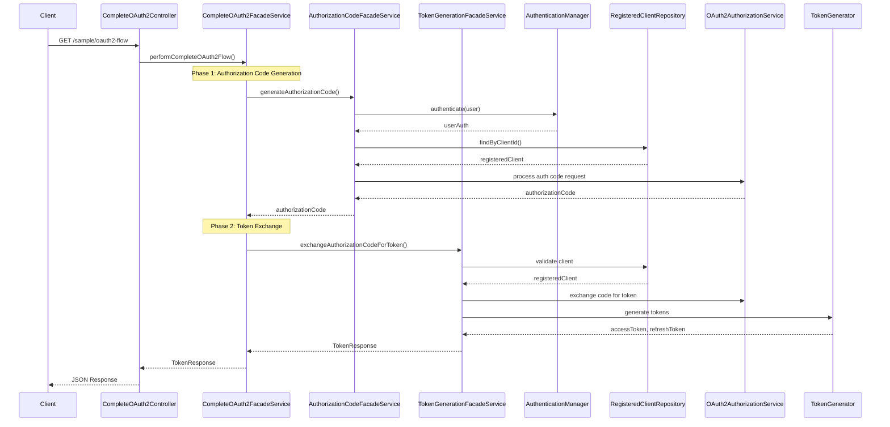

# OAuth2 Facade Flow Documentation

This document provides a detailed explanation of the **Facade Flow** implementation in the OAuth2 Authorization Server. The facade pattern is used to simplify the OAuth2 authorization code flow by providing a unified interface that handles both authorization code generation and token exchange in a single request.

---

## **Overview**

The Facade Flow consists of three main facade services that work together to provide a complete OAuth2 authorization code flow:

1. **AuthorizationCodeFacadeService** - Handles authorization code generation
2. **TokenGenerationFacadeService** - Handles token exchange
3. **CompleteOAuth2FacadeService** - Orchestrates the complete flow

This approach simplifies the traditional OAuth2 flow by combining multiple steps into a single service call, making it easier for clients to obtain access tokens without implementing the full OAuth2 protocol.

---

## **Architecture Components**

### **1. AuthorizationCodeFacadeService**

**Purpose**: Generates authorization codes for authenticated users and registered clients.

**Key Responsibilities**:
- User authentication validation
- Client validation and loading
- Authorization server context setup
- Authorization code request processing
- Authorization code extraction

**Main Method**: `generateAuthorizationCode(String username, String password, String clientId, String redirectUri, Set<String> scopes)`

**Flow Steps**:
1. **User Authentication**: Authenticates the user using provided credentials
2. **Client Validation**: Validates and loads the registered client
3. **Context Setup**: Creates authorization server context
4. **Request Processing**: Creates and processes authorization code request
5. **Code Extraction**: Extracts and returns the authorization code

### **2. TokenGenerationFacadeService**

**Purpose**: Exchanges authorization codes for access tokens and refresh tokens.

**Key Responsibilities**:
- Client authentication validation
- Authorization code validation
- Token generation and exchange
- Token response formatting

**Main Method**: `exchangeAuthorizationCodeForToken(String authorizationCode, String clientId, String clientSecret, String redirectUri)`

**Flow Steps**:
1. **Client Validation**: Validates client ID and secret
2. **Context Setup**: Creates authorization server context
3. **Client Authentication**: Creates client authentication token
4. **Token Exchange**: Processes authorization code authentication
5. **Response Extraction**: Extracts and formats token response

### **3. CompleteOAuth2FacadeService**

**Purpose**: Orchestrates the complete OAuth2 flow by combining authorization code generation and token exchange.

**Key Responsibilities**:
- Flow orchestration
- Error handling
- Response formatting

**Main Methods**:
- `performCompleteOAuth2Flow(String username, String password, String clientId, String clientSecret, String redirectUri, Set<String> scopes)`
- `performCompleteOAuth2Flow(String username, String password, String clientId, String clientSecret, String redirectUri, String scope)`

**Flow Steps**:
1. **Authorization Code Generation**: Calls AuthorizationCodeFacadeService
2. **Token Exchange**: Calls TokenGenerationFacadeService
3. **Response Return**: Returns complete token response

---

## **API Endpoint**

### **Complete OAuth2 Flow Endpoint**

**URL**: `GET /sample/oauth2-flow`

**Parameters**:
- `username` (required): User's username
- `password` (required): User's password
- `clientId` (required): OAuth2 client ID
- `clientSecret` (required): OAuth2 client secret
- `redirectUri` (required): Redirect URI for the client
- `scope` (optional, default: "read"): Space-separated list of scopes

**Example Request**:
```
GET /sample/oauth2-flow?username=user&password=pass&clientId=client&clientSecret=secret&redirectUri=http://localhost:9000/authorized&scope=read write
```

**Response Format**:
```json
{
  "accessToken": "eyJhbGciOiJSUzI1NiIsInR5cCI6IkpXVCJ9...",
  "tokenType": "Bearer",
  "expiresAt": "2024-01-15T10:30:00Z",
  "refreshToken": "eyJhbGciOiJSUzI1NiIsInR5cCI6IkpXVCJ9...",
  "scopes": ["read", "write"],
  "error": null,
  "errorDescription": null
}
```

---

## **Detailed Flow Sequence**

### **Step-by-Step Process**

#### **Phase 1: Authorization Code Generation**

1. **User Authentication**
   - The service receives username and password credentials
   - Uses Spring Security's AuthenticationManager to validate credentials
   - Sets the authenticated user in the security context

2. **Client Validation**
   - Validates the provided client ID against registered clients
   - Loads the complete client configuration
   - Ensures the client is properly registered and active

3. **Authorization Server Context Setup**
   - Creates an authorization server context for the request
   - Sets up the issuer URL and server settings
   - Establishes the security context for OAuth2 operations

4. **Authorization Code Request Creation**
   - Builds an authorization code request with all required parameters
   - Includes client ID, user authentication, redirect URI, and scopes
   - Prepares the request for processing

5. **Authorization Code Processing**
   - Uses the OAuth2AuthorizationCodeRequestAuthenticationProvider
   - Validates all request parameters
   - Generates a unique authorization code
   - Stores the authorization information

6. **Authorization Code Extraction**
   - Extracts the generated authorization code from the result
   - Returns the code for use in the next phase

#### **Phase 2: Token Exchange**

1. **Client Authentication Validation**
   - Validates the client ID and secret combination
   - Ensures the client credentials are correct
   - Loads the registered client configuration

2. **Client Authentication Token Creation**
   - Creates a client authentication token
   - Uses client secret basic authentication method
   - Prepares for token exchange

3. **Authorization Code Authentication**
   - Creates an authorization code authentication request
   - Includes the authorization code and client authentication
   - Prepares for token generation

4. **Token Generation**
   - Uses the OAuth2AuthorizationCodeAuthenticationProvider
   - Validates the authorization code
   - Generates access token and refresh token
   - Associates tokens with the user and client

5. **Token Response Extraction**
   - Extracts access token, refresh token, and metadata
   - Formats the response according to OAuth2 standards
   - Returns the complete token response

---

## **Sequence Diagram**



---

## **Security Considerations**

### **Authentication & Authorization**

1. **User Authentication**: Uses Spring Security's AuthenticationManager for user validation
2. **Client Authentication**: Validates client ID and secret combination
3. **Scope Validation**: Ensures requested scopes are valid for the client
4. **Redirect URI Validation**: Validates redirect URI against registered client configuration

### **Token Security**

1. **Authorization Code**: Single-use, short-lived codes
2. **Access Token**: Bearer tokens with expiration
3. **Refresh Token**: Long-lived tokens for token renewal
4. **Context Isolation**: Uses AuthorizationServerContextHolder for request isolation

---

## **Configuration Requirements**

### **Required Dependencies**

- Spring Security OAuth2 Authorization Server
- Spring Security Core
- Spring Boot Starter Web
- Spring Data JPA (for user management)

### **Required Beans**

- RegisteredClientRepository
- UserDetailsService
- AuthenticationManager
- OAuth2AuthorizationService
- AuthorizationServerSettings
- OAuth2TokenGenerator

### **Application Properties**

The application requires configuration for server settings, OAuth2 client registration, and database connectivity.

---

## **Usage Examples**

### **Basic Usage**

The endpoint can be called with basic parameters to obtain an access token for a user with read scope.

### **Multiple Scopes**

The endpoint supports multiple scopes by providing space-separated scope values in the request.

### **Using the Token**

Once obtained, the access token can be used in the Authorization header for subsequent API calls.

---