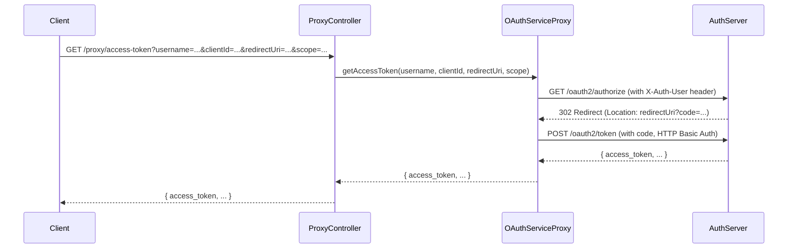

# Stateless OAuth2 Proxy Flow – Technical Documentation

## 1. Purpose
This proxy flow allows your backend to perform the entire OAuth2 Authorization Code Grant (including code generation and token exchange) in a single backend API call, **without browser interaction or session state**. It is designed to mimic legacy flows but is fully compatible with the latest Spring Authorization Server.

---

## 2. Key Components

### A. StatelessUserAuthenticationFilter
- **Location:** `src/main/java/com/example/proxy/StatelessUserAuthenticationFilter.java`
- **Role:**
  - Intercepts `/oauth2/authorize` and `/oauth2/token` requests.
  - Injects a stateless user authentication context (no session).
  - Sets the authenticated user in the `SecurityContextHolder` for the duration of the request.
  - Ensures the Authorization Server sees the user as authenticated.

### B. OAuthServiceProxy
- **Location:** `src/main/java/com/example/proxy/OAuthServiceProxy.java`
- **Role:**
  - Handles backend HTTP calls to `/oauth2/authorize` and `/oauth2/token`.
  - **Does NOT follow redirects** when calling `/oauth2/authorize` (so it can extract the code from the `Location` header).
  - Exchanges the code for an access token using HTTP Basic Auth for client authentication.
  - Returns the access token response as JSON.

### C. AuthTokenFacade
- **Location:** `src/main/java/com/example/proxy/AuthTokenFacade.java`
- **Role:**
  - Provides a single method to perform the full flow:
    1. Calls `/oauth2/authorize` (with stateless user context)
    2. Extracts the code from the redirect
    3. Calls `/oauth2/token` to get the access token

### D. AuthTokenController
- **Location:** `src/main/java/com/example/proxy/AuthTokenController.java`
- **Role:**
  - Exposes a REST endpoint:
    ```
    GET /proxy/access-token?username=...&clientId=...&redirectUri=...&scope=...
    ```
  - Calls the facade and returns the access token response.

---

## 3. Flow Diagram



---

## 4. How to Use

### A. Endpoint
```
GET /proxy/access-token?username=...&clientId=...&redirectUri=...&scope=...
```
- `username`: The user to authenticate as (injected by the filter)
- `clientId`: OAuth2 client ID (must match a registered client)
- `redirectUri`: Must match the registered redirect URI for the client
- `scope`: (optional) OAuth2 scopes

### B. Example Curl
```bash
curl -G "http://localhost:8081/proxy/access-token" \
  --data-urlencode "username=bill" \
  --data-urlencode "clientId=client" \
  --data-urlencode "redirectUri=http://localhost:8081/authorized" \
  --data-urlencode "scope=read"
```

---

## 5. Key Implementation Details

- **No HTTP Session:**
  The filter and security config ensure the flow is stateless.
- **No Redirect Following:**
  The proxy disables redirect following to extract the code from the `Location` header.
- **Client Authentication:**
  The token exchange uses HTTP Basic Auth (`setBasicAuth(clientId, clientSecret)`).
- **Error Handling:**
  - If the client credentials are wrong, you get `invalid_client`.
  - If the filter is not registered or the user is not set, you get redirected to `/login`.

---

## 6. Troubleshooting

- **"invalid_client" error:**
  - Ensure the client secret is correct and sent via HTTP Basic Auth.
- **Redirect to `/login`:**
  - The filter is not setting the authentication context correctly.
- **404 on `/authorized`:**
  - This is expected if you follow the redirect; the proxy should not follow it.

---

## 7. Migration Notes

- **Legacy:** Used `AuthorizationEndpoint` and `ModelAndView` to extract the code.
- **Modern:** Use backend HTTP call, extract code from 302 `Location` header.
- **Sessionless:** All authentication context is injected per-request.

---

## 8. Code References

- `StatelessUserAuthenticationFilter.java`
- `OAuthServiceProxy.java`
- `AuthTokenFacade.java`
- `AuthTokenController.java`
- `config/SecurityConfig.java` 