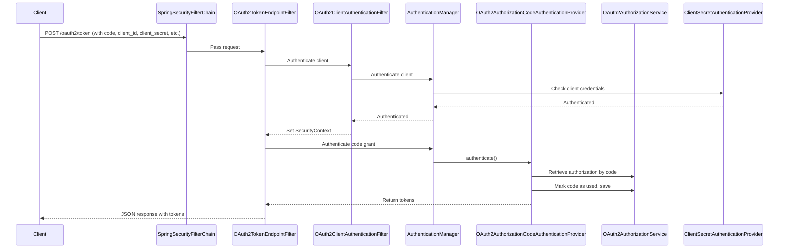

Let’s break down what happens, **step by step**, when you call the `/oauth2/token` endpoint in Spring Authorization Server—especially in the context of exchanging an authorization code for an access token.

---

## **1. The Client Makes a Token Request**

After the user authorizes the client and receives an authorization code, the client sends a **POST** request to `/oauth2/token` with parameters like:

- `grant_type=authorization_code`
- `code=...` (the code received)
- `redirect_uri=...`
- `client_id=...` (sometimes)
- `client_secret=...` (for confidential clients)

---

## **2. The Request Hits the Spring Security Filter Chain**

- The request enters the **Spring Security filter chain**.
- The chain includes many filters, but the most relevant for `/oauth2/token` are:
  - `OAuth2TokenEndpointFilter`
  - `OAuth2ClientAuthenticationFilter`
  - Others for security, CSRF, etc.

---

## **3. OAuth2TokenEndpointFilter**

- This filter is mapped to `/oauth2/token`.
- It:
  - Extracts the request parameters.
  - Converts them into an **`OAuth2AuthorizationCodeAuthenticationToken`** (for the authorization code grant).
  - Passes this token to the **AuthenticationManager**.

---

## **4. OAuth2ClientAuthenticationFilter**

- This filter authenticates the client (using `client_id` and `client_secret`).
- It tries several authentication providers:
  - `JwtClientAssertionAuthenticationProvider` (for JWT client assertions)
  - `ClientSecretAuthenticationProvider` (for client secret authentication)
- If successful, sets the client authentication in the SecurityContext.

---

## **5. AuthenticationManager & Provider**

- The AuthenticationManager delegates to the **`OAuth2AuthorizationCodeAuthenticationProvider`** (for the code grant).

---

## **6. Inside OAuth2AuthorizationCodeAuthenticationProvider**

### **A. Client Validation**
- Looks up the client using the authenticated client info.

### **B. Authorization Code Validation**
- Retrieves the authorization using the code from the database (`OAuth2AuthorizationService`).
- Checks:
  - Is the code valid and not expired?
  - Does it match the client and redirect URI?
  - Has it already been used?

### **C. PKCE Validation (if applicable)**
- If the client used PKCE, validates the code verifier.

### **D. Token Generation**
- If all checks pass:
  - Generates an **access token** (opaque or JWT, depending on your config).
  - Optionally generates a **refresh token**.
  - Marks the authorization code as used (so it can’t be reused).
  - Saves the updated authorization in the database.

### **E. Response**
- Returns a JSON response with:
  - `access_token`
  - `refresh_token` (if applicable)
  - `token_type`
  - `expires_in`
  - `scope`

---

## **7. What’s Involved Under the Hood?**

- **OAuth2TokenEndpointFilter**: Handles the endpoint and request conversion.
- **OAuth2ClientAuthenticationFilter**: Authenticates the client.
- **OAuth2AuthorizationCodeAuthenticationProvider**: Validates the code and issues tokens.
- **OAuth2AuthorizationService**: Persists and retrieves authorization data.
- **Token Generator**: Creates access and refresh tokens.
- **Security Context**: Maintains client authentication state.

---

## **Sequence Diagram**

---

## **Log Trace Example (from your logs)**

- **Filters invoked in order** (see your log lines: `Invoking ...Filter (N/24)`)
- **Client authentication**:  
  - `Authenticating request with ClientSecretAuthenticationProvider`
  - `Validated client authentication parameters`
- **Authorization code validation**:  
  - `Retrieved authorization with authorization code`
  - `Validated token request parameters`
- **Token generation**:  
  - `Generated access token`
  - `Generated refresh token`
  - `Saved authorization`
  - `Authenticated token request`

---

## **Summary Table**

| Step | Component | What it Does |
|------|-----------|--------------|
| 1    | Client   | Sends POST to `/oauth2/token` |
| 2    | Filter Chain | Passes through security filters |
| 3    | OAuth2TokenEndpointFilter | Handles endpoint, converts request |
| 4    | OAuth2ClientAuthenticationFilter | Authenticates client |
| 5    | AuthenticationManager | Delegates to provider |
| 6    | OAuth2AuthorizationCodeAuthenticationProvider | Validates code, issues tokens |
| 7    | OAuth2AuthorizationService | Persists authorization/token data |
| 8    | Filter/Provider | Returns JSON with tokens |

---